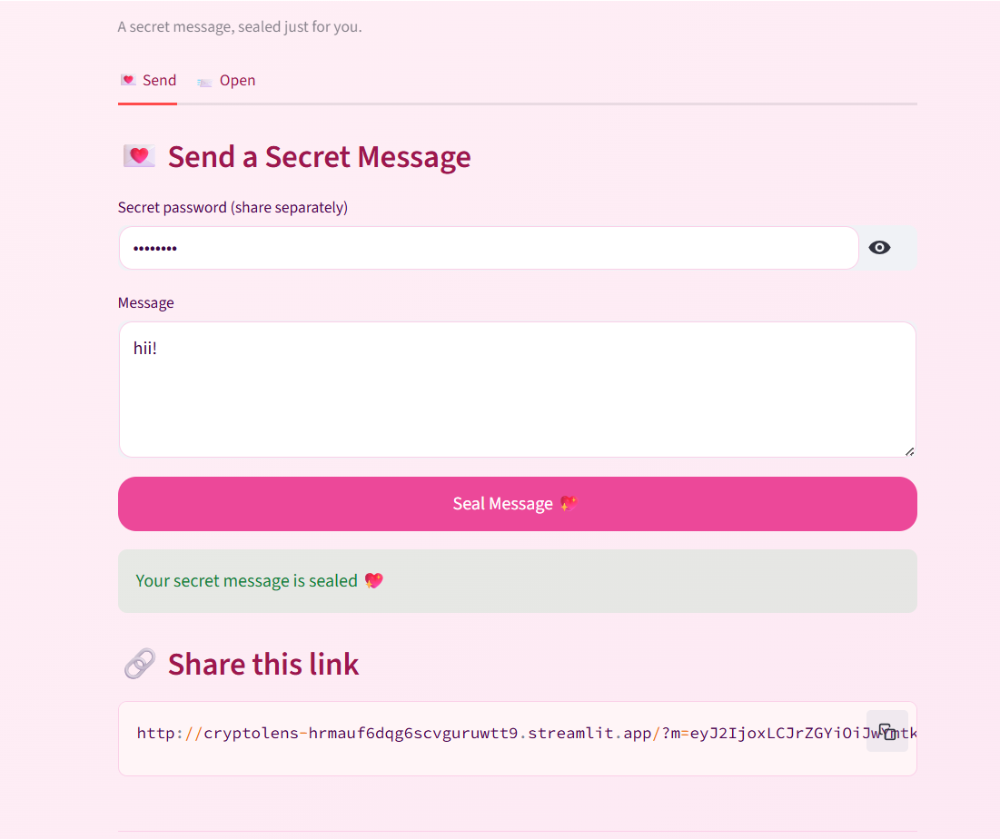
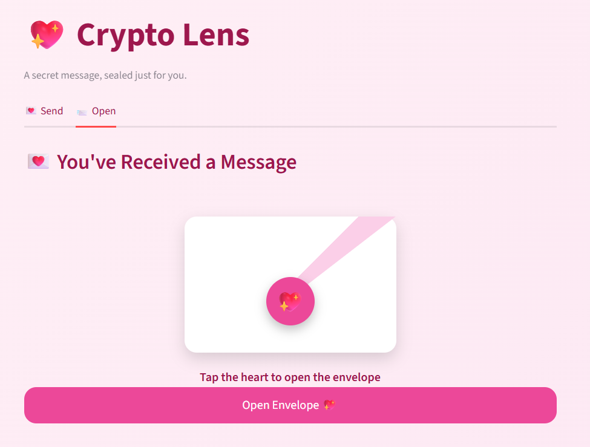
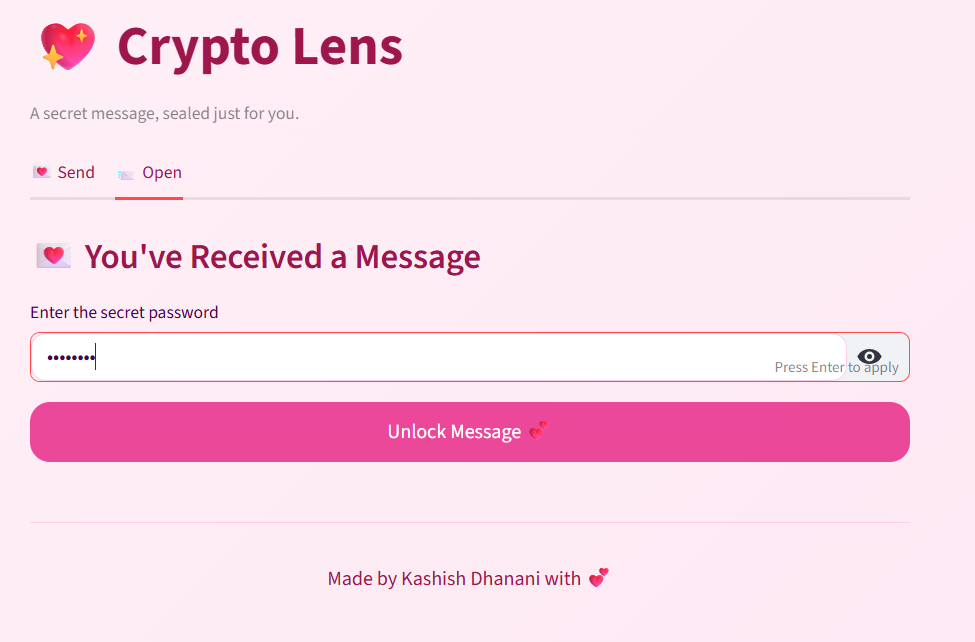
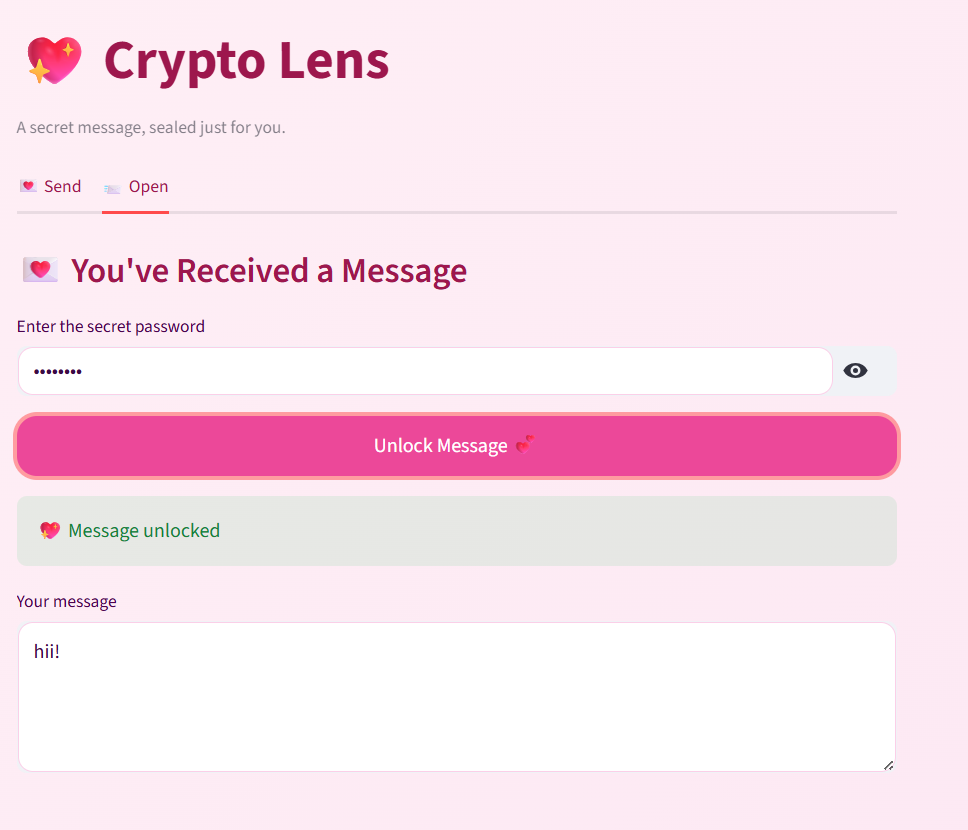

# 💖 Crypto Lens — Secret Message Encryption App

Crypto Lens is a **secure, password-based secret messaging web app** that lets you send encrypted messages to someone special.  
Only the person with the correct password can unlock and read the message.

Unlike simple demos, Crypto Lens focuses on **real cryptography**, **clean UX**, and a **romantic envelope-style reveal experience**, making encryption feel human and intuitive.

---

## 🌐 Live Demo

👉 **Live App:** https://cryptolens-hrmauf6dqg6scvguruwtt9.streamlit.app  
👉 **Source Code:** https://github.com/kashish-238/crypto_lens

---

## ✨ Features

- 🔐 Password-protected message encryption & decryption  
- 🛡️ AES encryption with PBKDF2 key derivation (industry standard)  
- 🔗 Shareable encrypted links (password is never included)  
- 💌 Envelope + heart seal reveal experience for receivers  
- 🔊 Soft sound effect when opening the message  
- 📱 Fully mobile-friendly (tested on phone browsers)  
- 🚫 No backend, no database, no message storage  
- ⚡ Runs entirely client-side using Streamlit  

---

## 🖼️ Screenshots






```md
## 🧠 How It Works
The sender writes a message and sets a secret password

The message is encrypted using AES (Fernet) with a derived key

An encrypted payload is embedded into a shareable link

The receiver opens the link and sees a sealed envelope

After entering the correct password, the message is decrypted locally

At no point is the password stored or transmitted.

## 🔐 Security Design
Uses **PBKDF2-HMAC-SHA256** for password-based key derivation

Uses **AES-based Fernet encryption** for message confidentiality

Each message uses a random salt

Password is never embedded in the URL

No logs, no persistence, no server-side storage

This project intentionally avoids “home-made crypto” and relies on trusted libraries.

## 🛠️ Tech Stack
1) Python 3

2) Streamlit

3) cryptography (Fernet, PBKDF2)

4) HTML & CSS (for custom UI and animations)

## 🚀 Running Locally
bash
Copy code
git clone https://github.com/kashish-238/crypto_lens.git
cd crypto_lens
pip install -r requirements.txt
streamlit run app.py
Then open:
http://localhost:8501

## 💡 Why This Project?
Crypto Lens was built to explore secure communication, UX-driven encryption, and real-world cryptographic practices — while also showing that security tools can be emotional, friendly, and thoughtfully designed.

## This project demonstrates:

1) Practical cryptography usage

2) Secure password handling

3) Front-end UX thinking

4) Mobile-first design

5) Deployment on Streamlit Cloud

## 📌 Future Improvements
1) Message expiration / self-destruct timer

2) Animated envelope opening

3) Custom sound effects

4) Optional message hints

5) Custom domain support

## 👤 Author
Kashish

GitHub: https://github.com/kashish-238
